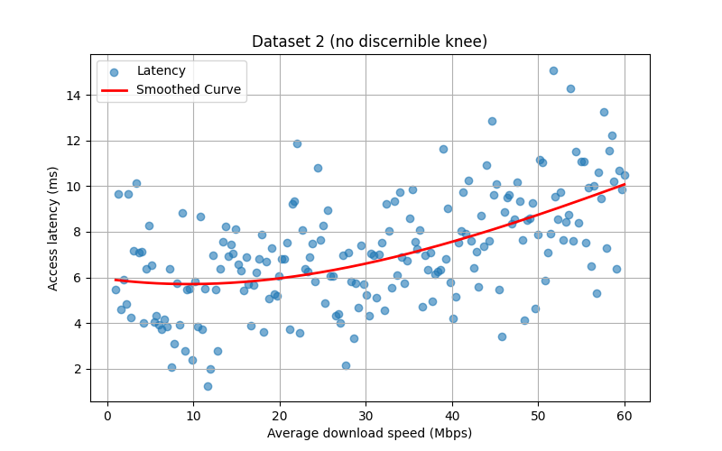
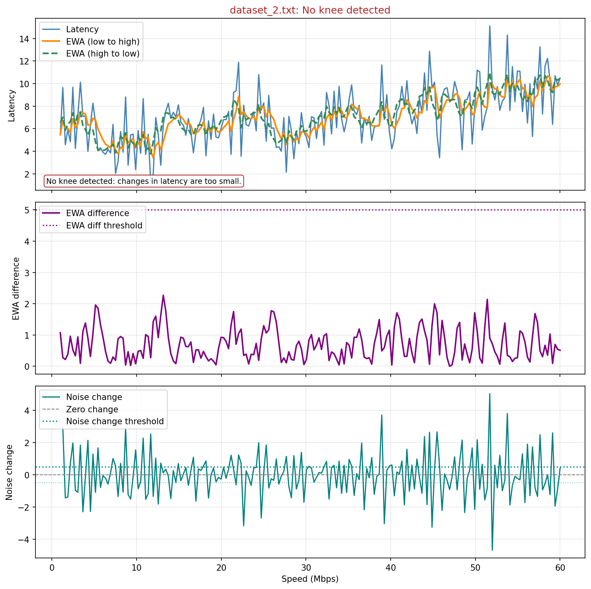
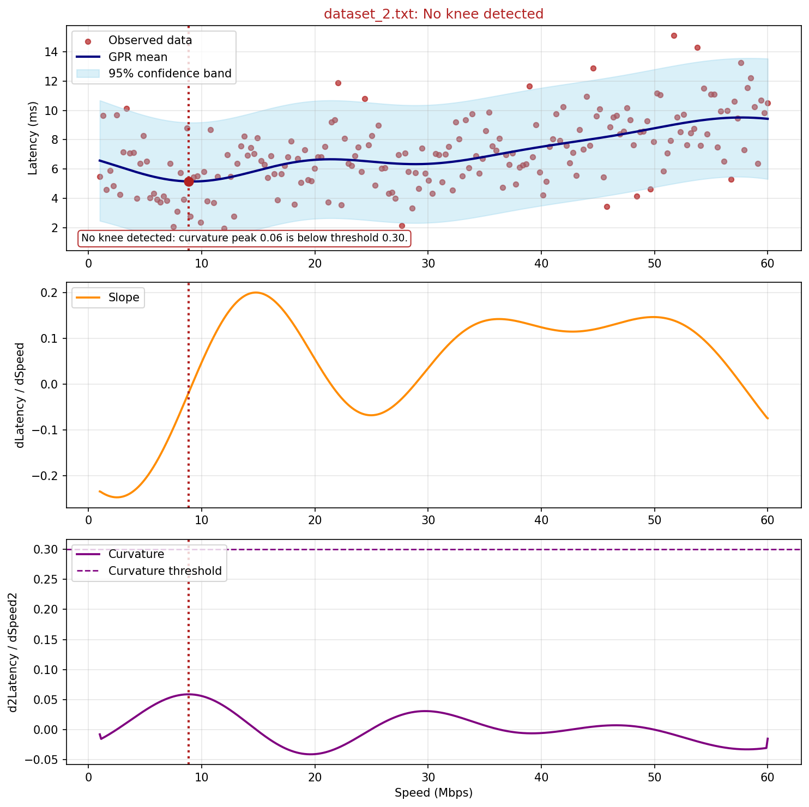
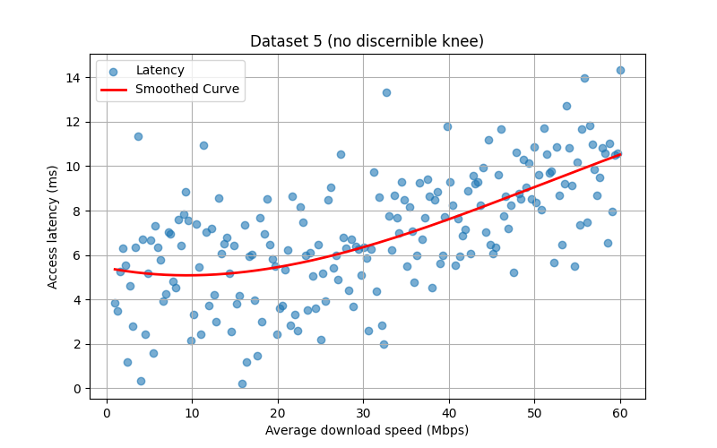
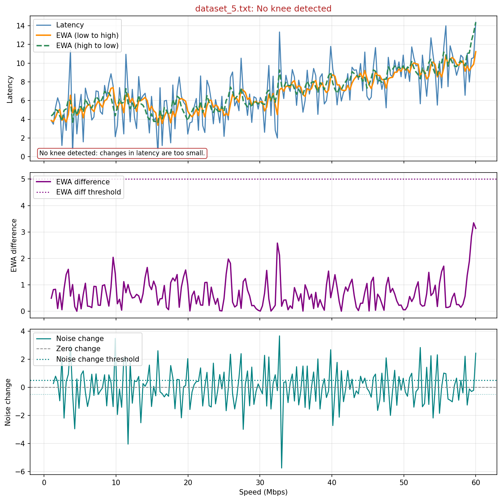
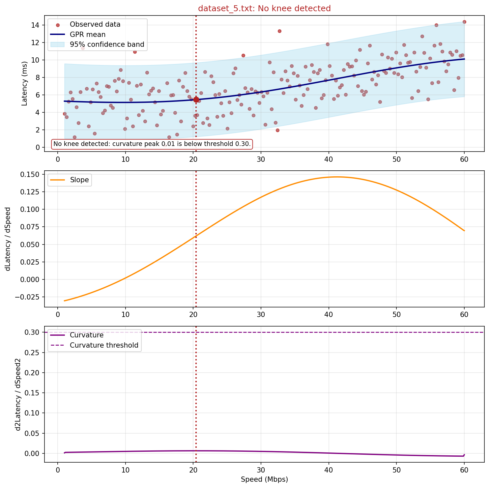

# TCP Congestion Knee Lab

This repository is a small Python experimentation lab for learning how congestion knees can be detected in latency-vs-throughput curves.

The core idea is simple: as offered speed increases, there may be a point where latency starts rising disproportionately. That point can be treated as a practical "knee" in the curve and used as a signal that pushing more traffic may no longer be beneficial.

This project was used as a learning exercise in:

- congestion and latency tradeoffs
- synthetic data generation for controlled experiments
- heuristic signal analysis
- Gaussian Process Regression as a statistical modeling approach
- comparing interpretable detection strategies through plots

## What The Experiment Does

The repository contains three main parts:

- `CongestionDataGen.py`: generates synthetic latency-vs-speed datasets with both knee and no-knee behaviours
- `KneeDetectionStandard.py`: applies a hand-built detector based on EWA smoothing, thresholds, gradients, and noise diagnostics
- `KneeDetectionGaussian.py`: applies Gaussian Process Regression to smooth the curve and then detect a knee from the fitted shape

There is also a `main.py` entrypoint to run common workflows, clear generated outputs, and export results.

## Why This Was Built

The goal was not to build a production congestion controller. The goal was to make the knee-detection problem concrete and inspectable.

Synthetic data makes that possible because it allows controlled scenarios such as:

- clear knees
- softer or ambiguous knees
- no-knee curves
- gentle proportional trends with noise

That makes it easier to reason about what each detector is actually doing, where it succeeds, and where it fails.

## Detection Approaches

### 1. Standard Detector

The standard detector is rule-based and interpretable. It:

- smooths latency using exponentially weighted averages
- compares a forward and reverse EWA to derive an EWA-difference signal
- tracks noise change around the smoothed curve
- checks whether the detected behaviour is strong enough to qualify as a meaningful knee

This approach is useful as a learning tool because every step is visible and easy to reason about.

### 2. Gaussian Detector

The Gaussian detector uses Gaussian Process Regression to fit a smooth latency curve and estimate uncertainty. It then uses the fitted curve to examine:

- slope
- curvature
- whether the curve bends sharply enough to support a knee decision

This is still an interpretable method, but it introduces a statistical learning model into the pipeline.

## Workflow

The basic workflow is:

1. Generate synthetic datasets and source plots.
2. Run the standard detector and inspect its diagnostics.
3. Run the Gaussian detector and compare the result.
4. Review where the two methods agree or disagree.

## Example Output Comparisons

The images below show how the same datasets can be interpreted by the two detection methods.

### Dataset 2

Source curve:



Standard detector output:



Gaussian detector output:



Dataset 2 is a useful example because it contains a visible transition region and shows how the two detectors reason differently about the same curve.

### Dataset 5

Source curve:



Standard detector output:



Gaussian detector output:



This is useful for comparing the standard detector's threshold-driven diagnostics against the Gaussian detector's smoothed slope and curvature view.

## What Was Learned

Some of the main learning points from this experiment were:

- knee detection is primarily a modeling and signal-analysis problem, not automatically a supervised ML problem
- a simple, interpretable heuristic can be very strong when the problem is well understood
- Gaussian Process Regression can help smooth noisy signals, but it does not remove the need for sensible decision logic
- visualization matters: seeing the curve, smoothing behaviour, noise behaviour, and thresholds together makes debugging much easier
- synthetic data is useful for proof-of-concept work, but it also encodes assumptions that must be understood

## Running The Project

Run from the repository root:

```powershell
python main.py
```

Or run a specific sequence:

```powershell
python main.py run --sequence generate standard
python main.py run --sequence generate gaussian
python main.py run --sequence generate standard gaussian --clear-first
```

Other supported actions:

```powershell
python main.py clear --yes
python main.py export --name demo_bundle
```

Generated `.txt` datasets are saved in `Datasets/`, and plots are saved in `Plots/`.

## Repository Structure

```text
.
├── CongestionDataGen.py
├── KneeDetectionStandard.py
├── KneeDetectionGaussian.py
├── main.py
├── Datasets/
└── Plots/
```

## Limitations

This project is intentionally limited in scope.

- the data is synthetic rather than collected from real routers
- the detectors are proof-of-concept methods, not production control logic
- the Gaussian approach uses statistical learning, but the final decision is still based on explicit detection rules

## Summary

This repository is best understood as a compact lab for exploring congestion-knee detection, comparing a heuristic detector with a Gaussian-process-based detector, and learning how theory, synthetic data, and diagnostics interact in practical algorithm design.
