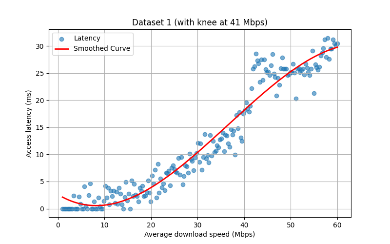
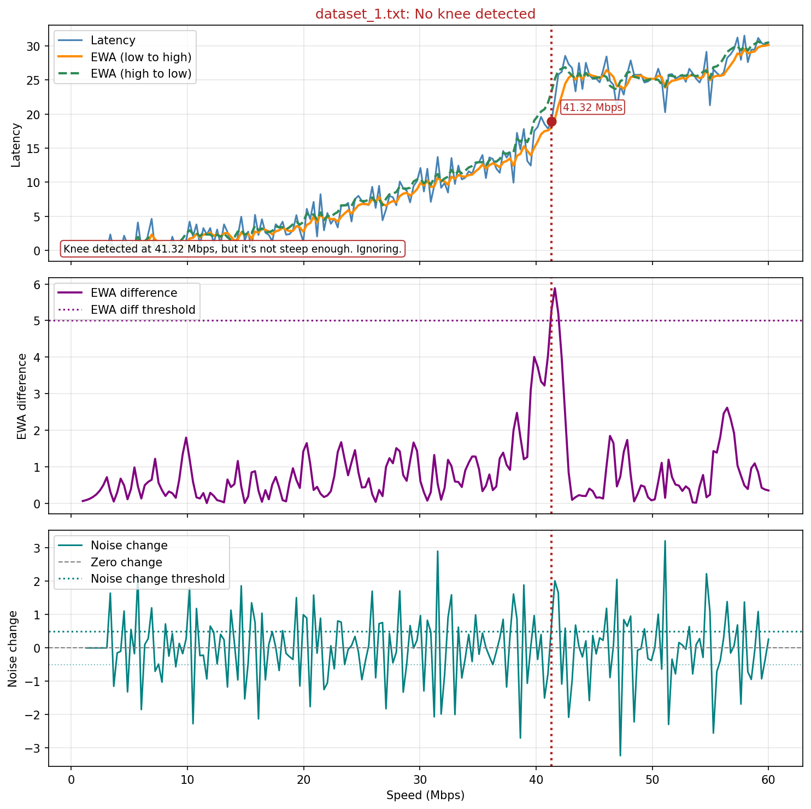
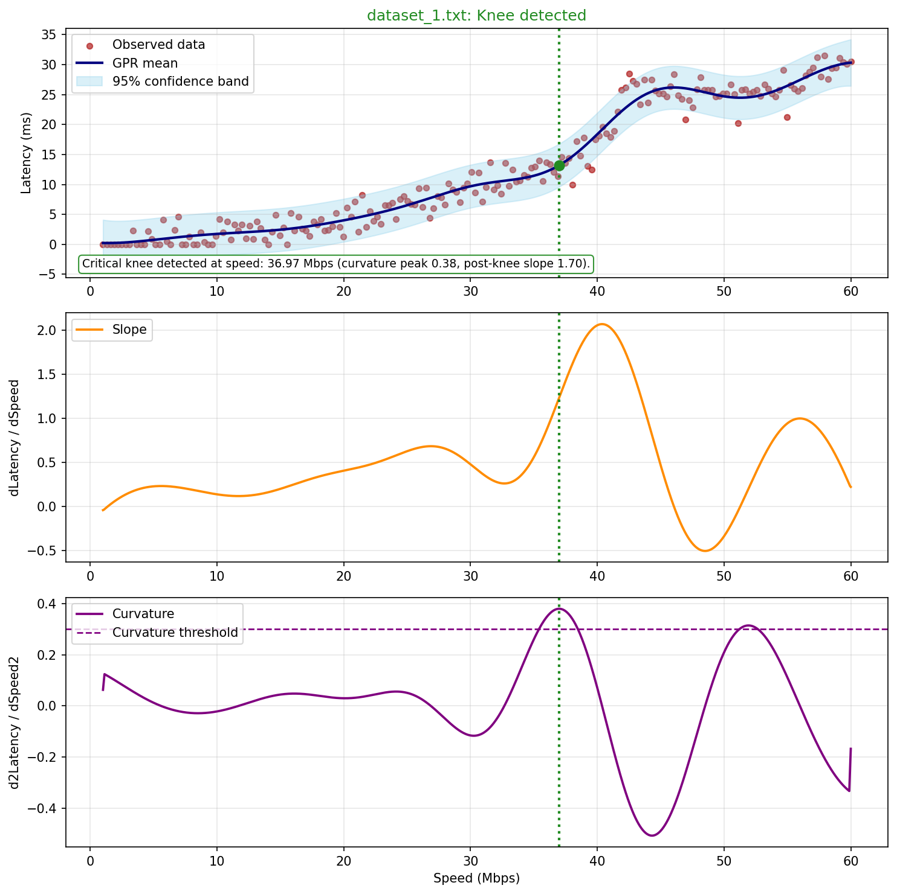
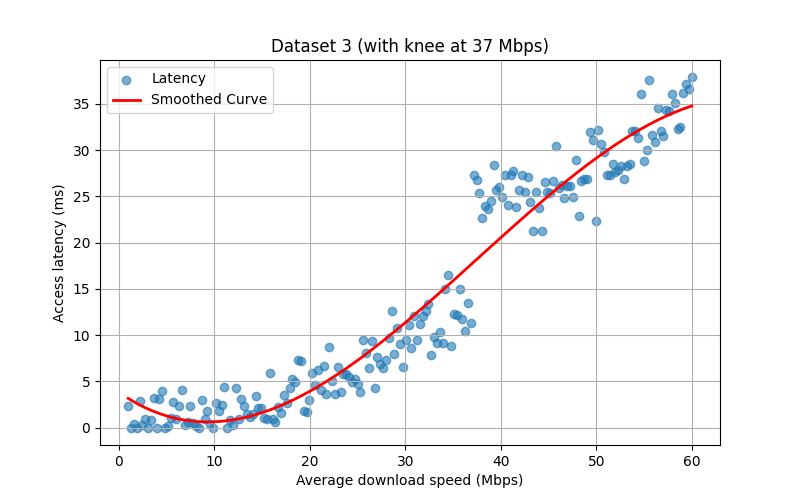
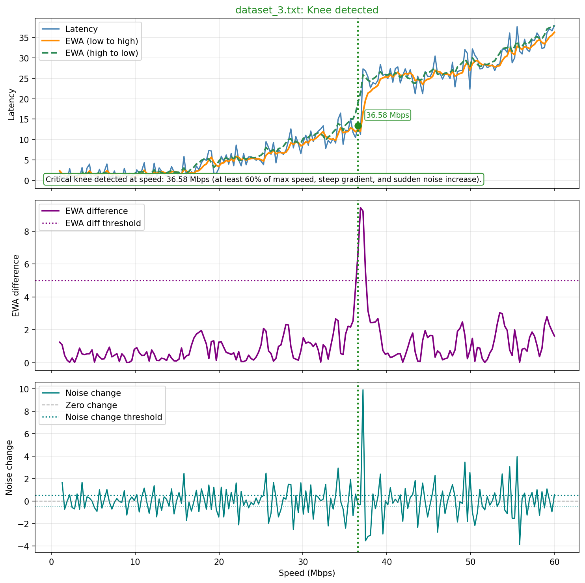
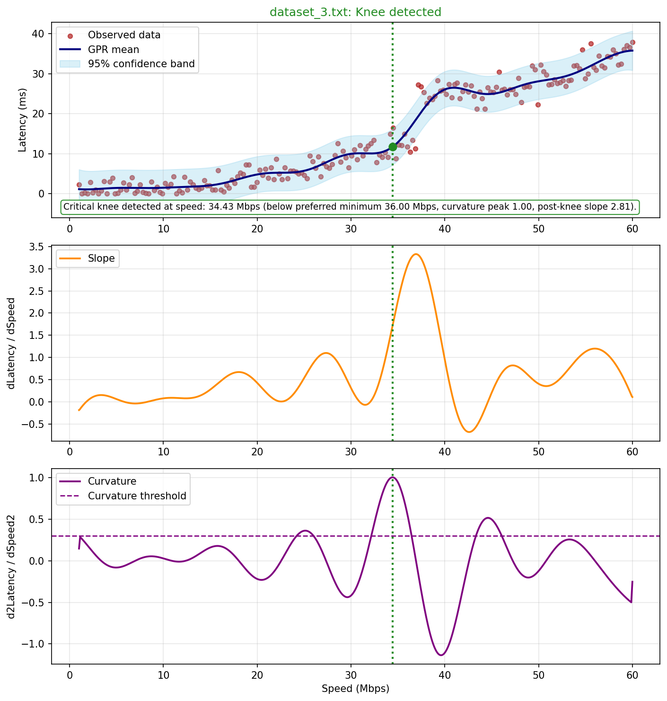

# TCP Congestion Knee Lab

This repository contains a Python-based study of congestion knee detection in latency-vs-throughput curves. It was built as part of a broader learning experience while working around a network optimization product, with the goal of understanding how speed-limiting decisions might be reasoned about from router telemetry.

At a high level, the project explores a simple but important idea from TCP acceleration and network optimization: increasing sending speed is not always beneficial. If traffic is pushed too aggressively, latency can rise sharply, queues can build, and the practical user experience can degrade even if raw throughput looks higher. The "knee" in a latency-vs-speed curve is the region where those tradeoffs begin to turn unfavourable.

## Project Context

This work sits inside a bigger line of thought: if a network optimization system receives telemetry from customer routers, how might it infer when a link is being pushed too far and decide whether a speed limit should be applied?

The project does not try to solve that whole operational problem. Instead, it isolates one core part of it:

- generate representative latency-vs-speed data
- test two detection strategies against that data
- compare how each method explains its decision

That made it a useful learning exercise in:

- congestion theory and TCP acceleration concepts
- translating networking intuition into observable signals
- synthetic data generation for controlled analysis
- heuristic detection logic
- Gaussian Process Regression as a statistical modeling method
- threshold tuning and visual debugging

## What The Data Generator Is Trying To Replicate

`CongestionDataGen.py` simulates router-like telemetry that could plausibly be seen from customer environments under different traffic conditions.

The synthetic datasets are not intended to mimic one exact device or protocol trace. They are intended to create a useful range of scenarios that a network optimization workflow might need to reason about, including:

- clear knees, where latency rises sharply after a certain speed
- softer or more ambiguous transitions
- non-knee trends, where latency increases gently without a decisive turning point
- noisy measurements, to reflect real-world instability and measurement variation

In other words, the generator acts as a stand-in for potential customer router data so the detection methods can be developed and inspected in a controlled setting.

## Repository Contents

- `CongestionDataGen.py`: generates synthetic datasets and source plots
- `KneeDetectionStandard.py`: heuristic detector based on EWA smoothing, thresholds, gradient checks, and noise diagnostics
- `KneeDetectionGaussian.py`: Gaussian Process Regression detector using a smoothed fit, slope, curvature, and decision rules
- `main.py`: simple workflow runner for generating data, running detectors, clearing outputs, and exporting result folders

Generated `.txt` datasets are stored in `Datasets/`, and generated images are stored in `Plots/`.

## Detection Methods

### Standard Detector

The standard detector is a rule-based method. It builds several diagnostic signals from the raw latency curve:

- the raw latency curve itself
- an exponentially weighted average computed from low speed to high speed
- a second exponentially weighted average computed in reverse
- the difference between the two EWAs
- a noise-change signal based on how far the observed latency deviates from the smoothed trend

Its output plot is intended to answer two questions:

1. Does the main latency curve visibly bend into a worse regime?
2. Do the EWA difference and noise diagnostics cross thresholds strongly enough to justify calling that bend a knee?

The standard detector therefore depends heavily on threshold choice. In practice, its behaviour is shaped by:

- `change_threshold`
- `noise_increase_threshold`
- `steep_gradient_threshold`
- `min_knee_speed_ratio`

These thresholds make the method interpretable, but also sensitive to parameter tuning.

### Gaussian Detector

The Gaussian detector first fits a Gaussian Process Regression model to the latency-vs-speed data. That produces:

- a smoothed mean curve
- an uncertainty band
- derived slope values
- derived curvature values

Its output plot is intended to show:

1. the observed data and the GP-smoothed latency trend
2. how the slope evolves across the speed range
3. where curvature becomes strong enough to support a knee hypothesis

This method is less directly threshold-driven than the standard detector, but it still relies on important decision parameters, especially:

- `curvature_threshold`
- `min_knee_speed_ratio`
- the rule requiring post-knee slope to be materially stronger than pre-knee slope

So although it uses a statistical model, the final knee decision is still based on explicit logic rather than a fully learned classifier. Here too, the minimum speed threshold matters: a detector may find a genuine turning point, but a control policy may still decide not to act on it if that point sits too low in the available speed range to justify enforcing a restrictive cap.
## Workflow

The basic workflow is:

1. Generate synthetic latency-vs-speed datasets.
2. Save source curves and raw text datasets.
3. Run the standard detector.
4. Run the Gaussian detector.
5. Compare the two outputs visually and inspect where they agree or disagree.

## Output Comparisons

Useful comparisons in this experiment can be drawn from datasets 1, 2, and 3.

### Dataset 1

Source curve:



Standard detector output:



Gaussian detector output:



Dataset 1 is a clear example of a knee-like transition in the generated data. Both methods identify a meaningful bend in the curve, but the standard detector rejects it because of its configured parameter checks. That makes this dataset useful for discussing not just detection, but the effect of threshold policy. In particular, it shows how `min_knee_speed_ratio` and related rule-based conditions can turn a visible knee candidate into a rejected decision.

### Dataset 2

Source curve:


Standard detector output:


Gaussian detector output:


Dataset 2 serves as a non-knee comparison case. It is useful because the curve does not show the same decisive turning behaviour as the clearer knee cases. This lets the outputs be inspected for false positives and for threshold sensitivity. It is also a good example of why diagnostic plots matter: a method can appear confident unless the underlying EWA, slope, curvature, and threshold behaviour are visible.

### Dataset 3

Source curve:



Standard detector output:



Gaussian detector output:



Dataset 3 is useful because both methods broadly concur. That makes it a good control example for comparing how they arrive at similar outcomes through different reasoning styles: thresholded heuristics in the standard method, and smoothed curve analysis in the Gaussian method.

## What This Work Was Useful For Learning

This setup was useful for learning several things at once:

- how congestion knees can be interpreted in terms of bandwidth, speed, and latency tradeoffs
- why increasing speed can stop being beneficial once latency begins rising disproportionately
- how synthetic telemetry can be used to test ideas before looking at real operational data
- how threshold choices influence the behaviour of heuristic detectors
- how a statistical smoother such as Gaussian Process Regression can help reveal structure in noisy data
- how to compare algorithm outputs critically rather than accepting the first plausible result

## Running The Project

Run from the repository root:

```powershell
python main.py
```

Or run specific sequences:

```powershell
python main.py run --sequence generate standard
python main.py run --sequence generate gaussian
python main.py run --sequence generate standard gaussian --clear-first
```


## Limitations

- the data is synthetic and simplified
- the thresholds are hand-tuned for exploratory purposes
- the Gaussian detector uses a learned regression model, but the final classification still depends on explicit rules
- the project focuses on curve interpretation, not on a full production feedback controller

## Summary

This repository documents a focused study of congestion knee detection as part of a broader network-optimization learning effort. It combines synthetic router-like data generation, a heuristic detector, a Gaussian-process-based detector, and visual comparison to explore when increasing speed helps, when it hurts, and how those turning points can be reasoned about in practice.
